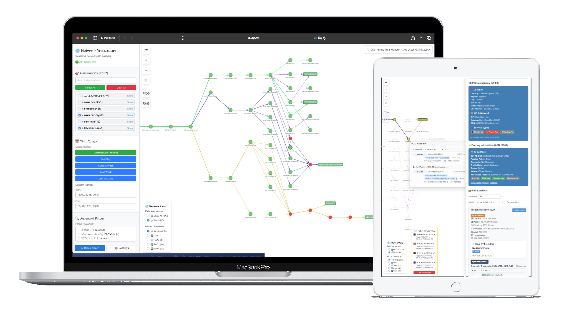

# 🌐 Network Traceroute visualisation

A powerful React-based application for visualizing network paths from traceroute data. Explore routing behavior, latency patterns, and peering relationships over time with interactive graphs and advanced filtering capabilities.



## 📋 Table of Contents

- [Getting Started](#getting-started)
- [Features](#features)
- [Interface Overview](#interface-overview)
- [Advanced Filtering](#advanced-filtering)
- [Path Aggregation](#path-aggregation)
- [Network Hierarchy](#network-hierarchy)
- [Path Highlighting](#path-highlighting)
- [Export and Import](#export-and-import)
- [Graph Optimization](#graph-optimization)
- [Performance Tips](#performance-tips)
- [Installation](#installation)
- [Usage](#usage)
- [Data Model](#data-model)
- [Troubleshooting](#troubleshooting)
- [FAQ](#faq)
- [Contributing](#contributing)
- [License](#license)

## 🚀 Getting Started

1. **Clone the repository**
   ```bash
   git clone https://github.com/tommy812/react-graph-vis.git
   cd react-graph-vis
   ```

2. **Install dependencies**
   ```bash
   # Frontend
   cd frontend
   npm install
   
   # Backend
   cd ../backend
   npm install
   ```

3. **Start the application**
   ```bash
   # Start backend server
   cd backend
   npm start
   
   # Start frontend (in new terminal)
   cd frontend
   npm start
   ```

4. **Access the application**
   - Open your browser to `http://localhost:3000`
   - Click **Open Charts** to enter the graph view
   - Select destinations from the sidebar to build network graphs

## ✨ Features

### Core Functionality
- **Interactive Network Graphs**: Visualize traceroute paths with nodes and edges
- **Real-time Data Processing**: Live traceroute data analysis and visualisation
- **Multi-destination Analysis**: Compare paths across multiple destinations
- **Time Range Filtering**: Focus on specific time periods for analysis
- **Advanced Path Filtering**: Filter by protocols, RTT, path types, and more

### Advanced visualisation
- **Path Aggregation**: Group paths by shared IPs to reduce visual clutter
- **Network Hierarchy**: Group nodes by ASN, subnet, ISP-POP, or ISP levels
- **Interactive Highlighting**: Click nodes/edges to highlight related paths
- **Color-coded Paths**: Visual distinction between primary and alternative routes

### Export & Sharing
- **Multiple Export Formats**: PNG, SVG, and JSON export options
- **Graph Import**: Load previously exported graph data
- **Fullscreen Mode**: Focused analysis and better screenshots

## 🖥️ Interface Overview

### Main Components
- **Sidebar**: Choose domains/IPs, set filters, manage time range
- **Graph Canvas**: Interactive nodes and edges representing hops and links
- **Controls Panel**: Zoom, fit to screen, layout and visibility options
- **Details Panels**: Hop information, full traceroutes, and peering data

### Navigation
- **Landing Page**: Welcome screen with quick access to charts and documentation
- **Documentation**: Comprehensive user guide accessible from any page
- **Responsive Design**: Optimized for desktop and mobile devices

## 🔍 Advanced Filtering

### Protocol Filtering
- Filter by **ICMP/TCP/UDP** protocols
- **Protocol Filtering Detection**: Automatically detects when protocols are filtered at network edges

### Path Type Filtering
- **Most/Least Used**: Paths with highest/lowest frequency
- **Fastest/Slowest**: Paths with lowest/highest average RTT
- **Fewest/Most Hops**: Paths with shortest/longest hop count

### Timeout Handling
- **Hide Successful Paths**: Show only paths that didn't reach destination
- **Only Successful Paths**: Show only paths that reached destination

### Additional Filters
- **RTT Range**: Constrain hops by round-trip time thresholds (min/max in milliseconds)
- **Usage %**: Require minimum frequency for alternative paths
- **Time Range**: Choose absolute dates or presets to scope data

## 📊 Path Aggregation

Advanced path aggregation helps reduce visual clutter and identify common network patterns:

### Aggregation Modes
- **Show All Paths**: Displays every individual path separately with unique colors (default)
- **Shared IPs**: Groups paths that share common intermediate hops, showing usage counts

### Aggregation Scope
- **Per-destination**: Aggregate paths within each destination separately
- **Cross-destination**: Aggregate paths across all selected destinations

### Performance Optimization
- **Smart Disabling**: "Show All Paths" automatically disabled for large selections
- **Automatic Strategy Selection**: System chooses optimal aggregation based on data size

## 🏗️ Network Hierarchy

Group network nodes by different levels of network hierarchy to understand routing at various scales:

### Hierarchy Levels
- **Individual IPs**: Show every IP address separately (default)
- **ASN**: Group IPs by Autonomous System Number
- **Prefix (/64)**: Group IPs by /64 subnet prefixes
- **ISP-POP (/48)**: Group IPs by /48 prefixes (ISP Point of Presence level)
- **ISP (/32)**: Group IPs by /32 prefixes (ISP level)

### Interactive Features
- **Prefix Grouping**: Enable expanding/collapsing grouped prefixes
- **Click to Expand**: Click grouped nodes to see individual IPs
- **Collapse All**: Quick reset of all expanded groups

## 🎯 Path Highlighting

Interactive path highlighting helps trace specific routes through the network:

### Highlighting Features
- **Click to Highlight**: Click any node or edge to highlight all paths that use it
- **Color Coding**: Each highlighted path gets a unique color for easy identification
- **Path Information Panel**: Detailed information about highlighted paths including:
  - Destination addresses
  - Path types (primary/alternative)
  - Protocols used
  - Node and edge counts

### Visual Indicators
- **Solid Lines**: Primary paths
- **Dashed Lines**: Alternative paths
- **Clear Highlights**: Reset highlighting with one click

## 📤 Export and Import

### Graph Export
- **PNG**: High-quality raster image for presentations
- **SVG**: Scalable vector format for editing
- **JSON**: Complete graph data for analysis or sharing

### Graph Import
- **JSON Import**: Load previously exported graph data
- **Share visualisations**: Share graph states with others
- **Historical Analysis**: Analyze saved network states

### Additional Features
- **Fullscreen Mode**: Toggle fullscreen for focused analysis
- **Responsive Controls**: All export/import controls adapt to screen size

## ⚡ Graph Optimization

Advanced algorithms automatically optimize graph layout and path ordering for better visualisation:

### Layout Optimization
- **Edge Crossing Minimization**: Intelligent algorithms reduce visual clutter
- **Topology-aware Sorting**: Consider network structure for optimal ordering
- **Centrality-based Prioritization**: Focus on important network nodes

### Path Sorting Strategies
- **Hop Count**: Sort paths by number of hops
- **Multi-criteria**: Combine hop count, success rate, and RTT
- **Topology-aware**: Consider network structure for optimal ordering
- **Centrality-based**: Prioritize paths through important network nodes

### Performance Features
- **Automatic Strategy Selection**: Based on data size and complexity
- **Memoization and Caching**: Faster re-renders
- **Virtual Rendering**: Handle large datasets efficiently
- **Protocol Filtering Detection**: Automatic detection of network edge filtering

## 🚀 Performance Tips

### Selection Management
- Limit the number of concurrently selected IPs to speed up renders
- Use time range filtering to reduce dataset size

### Aggregation Strategies
- Use "Shared IPs" aggregation for large selections to reduce visual complexity
- Enable network hierarchy grouping to simplify large graphs
- Note that "Show All Paths" is automatically disabled for large selections

### Optimization Features
- Automatic layout optimization minimizes edge crossings
- Smart path sorting improves visual clarity
- Memoization and caching speed up re-renders
- Virtual rendering handles large datasets efficiently

### Mobile Optimization
- Responsive controls automatically adapt to screen size
- Touch-friendly interface for mobile devices

## 🛠️ Installation

### Prerequisites
- Node.js (v14 or higher)
- npm or yarn
- Python 3.7+ (for backend services)

### Backend Setup
```bash
cd backend
npm install
# Configure database connection in config/database.js
npm start
```

### Frontend Setup
```bash
cd frontend
npm install
npm start
```


## 📖 Usage

### Basic Workflow
1. **Select Destinations**: Choose IP addresses or domains from the sidebar
2. **Set Time Range**: Use quick access presets or custom date ranges
3. **Apply Filters**: Use advanced filters to focus on specific data
4. **Explore Graph**: Click nodes/edges to highlight paths and view details
5. **Export Results**: Save visualisations or data for further analysis

### Advanced Usage
- **Compare Destinations**: Select multiple IPs to see shared paths
- **Analyze Patterns**: Use aggregation modes to identify common routing patterns
- **Investigate Issues**: Filter by timeout patterns to find connectivity problems
- **Share Findings**: Export graphs and data for collaboration

## 📊 Data Model

### Structure
```
Domains → Destinations (IPs) → Trace runs → Hops
```

### Data Components
- **Domains**: Grouped destination domains
- **Destinations**: Individual IP addresses
- **Trace Runs**: Individual traceroute executions
- **Hops**: Network nodes with RTT, ASN, geolocation, and loss indicators

### Path Classification
- **Primary Paths**: Most frequently observed routes
- **Alternative Paths**: Less common routes with usage percentages
- **Path Types**: Most used, least used, fastest, slowest, fewest hops, most hops

## 🔧 Troubleshooting

### Common Issues
- **No data appears**: Ensure at least one destination IP is selected and time range includes runs
- **High latency spikes**: Verify protocol filter and compare across time ranges
- **Missing ASN/Geo**: Data may be incomplete; check PeeringDB panel for context
- **Performance issues**: Reduce selection size or use aggregation modes

### Debug Information
- Check browser console for error messages
- Verify backend API connectivity
- Ensure database contains traceroute data
- Check network connectivity for data fetching

## ❓ FAQ

### General Questions
- **What is a primary path?** The most frequently observed route for a destination
- **What are alternative paths?** Less common routes with associated usage percentages
- **Can I compare two destinations?** Yes. Select multiple IPs; the graph merges paths and highlights shared hops

### Feature Questions
- **Why is "Show All Paths" disabled?** This feature is automatically disabled for large selections to maintain performance. Use "Shared IPs" aggregation instead
- **What's the difference between aggregation modes?**
  - **Show All Paths**: Displays every individual path with unique colors
  - **Shared IPs**: Groups paths that share common intermediate hops, showing usage counts
- **How does network hierarchy work?** You can group IPs by different network levels (ASN, subnet, ISP-POP, ISP) to understand routing at various scales. Click grouped nodes to expand and see individual IPs
- **Can I save and share my graph visualisations?** Yes! Use the JSON export feature to save graph data, then import it later or share with others
- **What's protocol filtering detection?** The system automatically detects when network protocols are filtered at network edges by analyzing traceroute behavior patterns

## 🤝 Contributing

This is an **open-source** project. We welcome contributions from the community!

### How to Contribute
1. Fork the repository
2. Create a feature branch (`git checkout -b feature/amazing-feature`)
3. Commit your changes (`git commit -m 'Add some amazing feature'`)
4. Push to the branch (`git push origin feature/amazing-feature`)
5. Open a Pull Request

### Development Guidelines
- Follow existing code style and conventions
- Add tests for new features
- Update documentation for API changes
- Ensure all tests pass before submitting PR

### Reporting Issues
- Use GitHub Issues to report bugs or request features
- Provide detailed reproduction steps for bugs
- Include system information and error logs

## 📄 License

This project is licensed under the GNU General Public License (GPL) - see the [LICENSE](LICENSE) file for details.

## 🙏 Acknowledgments

- Built with React and vis.js for graph visualisation
- Backend powered by Node.js and Express
- Python services for traceroute execution and parsing

---
